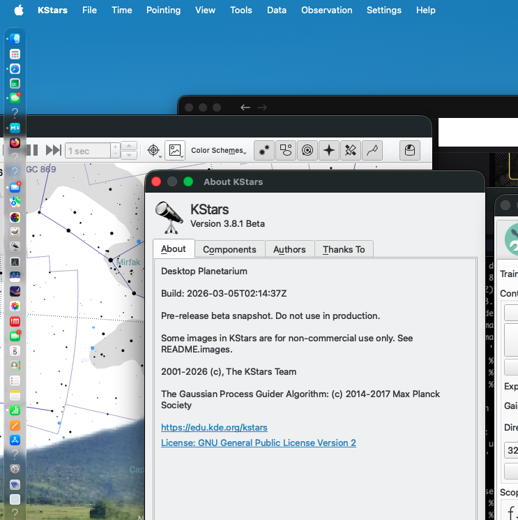

# Compile KStars on Mac Silicon from source

I have a Mac M2 Silicon, and I would like to compile kStars from source.
The version of KStars is   3.8.1

## Prerequisite's

I am going to assume you are a programmer or at least technical on a pc.... if not, err good luck.

Next, my environment for development is set as the following

- QT Installed as a **NATIVE** package i.e. ~/Dev/QT_Compiler
  - **NOT** I repeat *NOT* using brew for provide QT
  - I am using QT 6.10.1 (QT5 is too old imho)
- brew is installed, and I use for general packages, eigen etc. But **NOT** for QT
  - openCV was build from source not using brew, as this pulled in QT6
  - I have a typical development base with brew (cmake cmake-extras etc)

### Brew Packages

I do clear out !! brew every now and then, so this is relatively applicable (but as I see ollama I can tell some packages are not needed), but this is what my brew installed packages are

```
ada-url   dbus   gdbm   jpeg-turbo  libssh2   libxi   mlx   pango   telnet
aria2   deno   gettext   lame   libthai   libxinerama  mlx-c   pcre2   tig
astrometry-net  docbook   giflib   libdatrie  libtiff   libxml2   mpdecimal  pixman   tree-sitter@0.25
bison   docbook-xsl  glib   libev   libunistring  libxrandr  mpfr   pkcs11-helper  unibilium
brotli   eigen   gmp   libgcrypt  libusb   libxrender  ncurses   pkgconf   utf8proc
c-ares   extra-cmake-modules graphite2  libgpg-error  libuv   libxslt   neovim   python@3.10  uvwasi
ca-certificates  ffmpeg   gsl   libidn2   libvpx   libxv   netpbm   python@3.14  wcslib
cairo   fmt   harfbuzz  libmpc   libx11   little-cms2  node   readline  wget
ccfits   fontconfig  hdrhistogram_c  libnghttp2  libxau   llhttp   numpy   sdl2   x264
certifi   fop   html-xml-utils  libnghttp3  libxcb   lpeg   ollama   sdl3   x265
cfitsio   freerdp   icu4c@78  libngtcp2  libxcursor  luajit   openblas  sdl3_ttf  xorgproto
cjson   freetype  iperf3   libnova   libxdmcp  luv   openjdk   simdjson  xz
cmake   fribidi   isl   libomp   libxext   lz4   openssl@3  sqlite   yt-dlp
dav1d   gcc   jasper   libpng   libxfixes  lzo   opus   svt-av1   zstd
```

## Get kstars Source

A simple git clone

 cd ~/Dev/C++/Astro # Or where you want
    git clone <https://github.com/KDE/kstars>
    cd kstars #We are now in the main source folder

As the CMake commands can get a little complex - I usually use a small bash script to make this more repeatable

So in the kstars source I do  

    mkdir build
    cd build 

Here, typically you do a

    cmake ../ 

But - please use a script like this (mine is called *t.sh*), but use what ever you can type quickly and easily.
This script is executable i.e. **chmod +x t.sh**

```bash
#/bin/bash
PATH=~/Dev/QtCompiler/6.10.1/macos/bin:$PATH

export KF6_PREFIX=$HOME/kf6
QT_ROOT=$(qmake6 -query QT_INSTALL_PREFIX)
echo "QT is based at $QT_ROOT"
rm CMakeCache.txt   #Remove when you are nearly finished
cmake \
  -DCMAKE_PREFIX_PATH="$QT_ROOT;$KF6_PREFIX" \
  -DCMAKE_BUILD_RPATH=$QT_ROOT/lib \
  -DCMAKE_INSTALL_RPATH=$QT_ROOT/lib \
  -DCMAKE_INSTALL_RPATH_USE_LINK_PATH=TRUE \
  -DCMAKE_POSITION_INDEPENDENT_CODE=ON \
  -DAPPLE_SUPPRESS_X11_WARNING=ON \
  -DQt6_DIR=$QT_ROOT/lib/cmake/Qt6 \
  -DUSE_QT6=ON \
  -DBUILD_WITH_QT6=ON \
  -DQT_DEBUG_FIND_PACKAGE=ON \
  -DCMAKE_BUILD_TYPE=Release \
  -DCMAKE_INSTALL_PREFIX=/usr/local \
  -DBUILD_TESTING=OFF \
  ..
```

This almost 100% will fail, when you 1st try and use it. CMake will say something like

```bash
Missing Package eigen  
```

This is normally expressed that it can not find eigen.cmake-rules

So try to look inside brew

    brew search eigen 

If the package is found ...

     brew install eigen 

I am sorry that I do not have a list of packages I have installed, but as I have already been coding in FITS/Indi etc.... it is probably best you assemble this for yourself.

**Until** you get the **KF6 Framework** not found. This is a whole different issue....

# KF6 Framework

You may have noticed at the top of my build script there was an env setting for KF6 (shame if you did not see it).

    export KF6_PREFIX=$HOME/kf6

I tried to get kf6 to install via brew, but I could not get it to work (maybe you can); So I took a *very* deep breath and decided to install KF6 manually !! I had removed all KF6 from brew before I attempted this.

## KF6 FrameWork build

I created a fresh folder

    mkdir ~/Dev/KDE 
    cd ~/Dev/KDE 

And now I created another *cmake helper* script (also called *t.sh*)

```t.sh
#!/bin/bash
PATH=~/Dev/QtCompiler/6.10.1/macos/bin:$PATH
QT_ROOT=$(qmake6 -query QT_INSTALL_PREFIX)
cmake .. \
  -DCMAKE_PREFIX_PATH=/opt/homebrew/opt/qt \
  -DCMAKE_INSTALL_PREFIX=$HOME/kf6 \
  -DBUILD_TESTING=OFF \
  -DAPPLE_SUPPRESS_X11_WARNING=ON

cmake --build . -j$(sysctl -n hw.ncpu)
cmake --install .
```

KStars complained that it needed Kio NewStuff Plotting (and others) So I tried to just build those items, but of course they have pre-requisites. This is the order that I came up with.

So I believe you need to build in this Order - please note I am not an expert of KF6/KDE

- kcoreaddons
- kconfig
- ki18n
- kwidgetsaddons
- kcrash
- karchive
- kguiaddons
- kitemviews
- kcodecs
- kcolorscheme
- breeze-icons
- kiconthemes
- kconfigwidgets
- kxmlgui
- kcompletion
- solid
- kwindowsystem
- kdocbook
- kbookmarks
- knotifications
- kjobwidgets
- khelp
- kdbusaddons
- kded
- kio
- knotifyconfig
- kservice
- kPlotting
- kPackage
- attika
- kNewStuff

Typically I would wrap this is a bash script - but some (not all) needed some *adjusting*.

### Building 1 Module

Lets, start at the top  - with kcoreaddons

I go to my KDE build folder (Which I created earlier)

     cd ~/Dev/Dev/KDE 
     git clone https://invent.kde.org/frameworks/kcoreaddons.git 

It is the same *<https://invent.kde.org/frameworks/>* then with the **package** and then *.git* appended.

We enter the folder, and get setup

    cd kcoreaddons. #cd <package> 
    mkdir build 
    cd build 
    cp ../../t.sh .   #Copy my helper script 

So we create a build folder, go into it, then copy the t.sh template - next we execute it

    ./t.sh 

This will perform the cmake, then build (make), and finally install (make install)

For 90% of KF6 Framework this is all you have to do.

## The Problem modules

Problem is a little mean, We are compiling on a Mac (Darwin) something that expects to be running on Linux, so some adjustment is necessary.

If there are any missing mods, I apologize. This process took a few days.

### breeze-icons

This needed a *fix* (hack?) in the CMakeFiles.txt; I needed it to use a Virtual Python Environment, into which I had installed lxml (I did not want to force lxml into the main python env, nor should you).

Change in CMakeFile.txt

- find_package(Python 3 COMPONENTS Interpreter REQUIRED)
- find_package(Python3 COMPONENTS Interpreter REQUIRED)

This is the change I made, after that

    rm CMakeCache.txt
    ./t.sh   

### solid

The installed version of *bison* is too old by default on a mac, and I needed to force a brew update.

    brew install bison 
    
check the version with

    bison -V

I had flashback to university days, I was expecting yacc and lex next.

### kdocbook

This was the most difficult to install. Due to the non english languages being built. My solution (I do apoliogize), was to remove all translation files in the source folder except english.

This also required some more brew packages

    brew install docbook docbook-xsl libxslt fop 

But as some of these brew packages conflict with some system libraries they are not in the PATH (hence the *adjusting* of the build script).

And finally I needed a slightly modified *t.sh* script

```
PATH=~/Dev/QtCompiler/6.10.1/macos/bin:$PATH
export XML2_DIR=$(brew --prefix libxml2)
export XSLT_DIR=$(brew --prefix libxslt)

export LDFLAGS="-L$XML2_DIR/lib -L$XSLT_DIR/lib"
export CPPFLAGS="-I$XML2_DIR/include -I$XSLT_DIR/include"
export PKG_CONFIG_PATH="$XML2_DIR/lib/pkgconfig:$XSLT_DIR/lib/pkgconfig"

QT_ROOT=$(qmake6 -query QT_INSTALL_PREFIX)
cmake .. \
  -DCMAKE_INSTALL_PREFIX=$HOME/kf6 \
  -DCMAKE_PREFIX_PATH="$QT_ROOT;$(brew --prefix extra-cmake-modules)" \
  -DQt6_DIR=$QT_ROOT/lib/cmake/Qt6 \
  -DBUILD_TESTING=OFF \
  -DCMAKE_CXX_FLAGS="-Uisnan -Uisinf -Uisfinite" \
  -DCMAKE_CXX_STANDARD=20 \
  -DCMAKE_CXX_STANDARD_REQUIRED=ON \
  -DCMAKE_CXX_EXTENSIONS=OFF \
  -DAPPLE_SUPPRESS_X11_WARNING=ON

cmake --build . -j$(sysctl -n hw.ncpu)
cmake --install .
```

### kded

Another *language* issue. Solved by removing all language files in the po folder except *en_GB*

### kio

It is sad to see the KF6 framework, not even thinking of DARWIN, it has OS based compiles for WINDOWS and OTHER !! But was not a major issue.

I had to modify the following files

 modified:   src/core/udsentry.cpp
 modified:   src/kioworkers/file/stat_unix.h
 modified:   src/kioworkers/trash/kio_trash.cpp

All 3 files have the same basic issue ...

The file access structure has a different naming system on Mac, than on linux...

So the changes will be something like this

```C++
+#if defined(__APPLE__)
+  d->insert(UDS_MODIFICATION_TIME_NS_OFFSET,
+            buff.st_mtimespec.tv_nsec / 1000000);
+  d->insert(UDS_ACCESS_TIME_NS_OFFSET, buff.st_atimespec.tv_nsec / 1000000);
+  d->insert(UDS_LOCAL_USER_ID, buff.st_uid);
+  d->insert(UDS_LOCAL_GROUP_ID, buff.st_gid);
+#else
+  d->insert(UDS_MODIFICATION_TIME_NS_OFFSET, buff.st_mtim.tv_nsec / 1000000);
+  d->insert(UDS_ACCESS_TIME_NS_OFFSET, buff.st_atim.tv_nsec / 1000000);
+  d->insert(UDS_LOCAL_USER_ID, buff.st_uid);
+  d->insert(UDS_LOCAL_GROUP_ID, buff.st_gid);
 #endif
```

### kPackage

 Another Language issue - solved the same way.... I only left *en_GB*

# KStars Build

With KF6 Framework build we return to the kstars/build directory, and

    rm CMakeCache.txt 
    ./t.sh 
    make -j4
    

And we (hopefully) see

```text
tim@Tim-M1 build % make
[  0%] Generating mo...
[  0%] Built target pofiles-b16afee0cf0e73d893e7c15a166a2b46
[  1%] Generating ts...
[  1%] Built target tsfiles-b16afee0cf0e73d893e7c15a166a2b46
[  1%] Built target LibKSDataHandlers_autogen_timestamp_deps
[  1%] Built target LibKSDataHandlers_autogen
[  1%] Built target LibKSDataHandlers
[  1%] Built target htmesh_autogen_timestamp_deps
[  2%] Built target htmesh_autogen
[  4%] Built target htmesh
[  5%] Built target KStarsLib_autogen_timestamp_deps
[  5%] Built target KStarsLib_autogen
[ 99%] Built target KStarsLib
[ 99%] Built target kstars_autogen_timestamp_deps
[ 99%] Built target kstars_autogen
[100%] Built target kstars
```

Well-done KStars built Natively on a Mac.  



# Run A Simulator and have a play

Please follow this simulator [Simulator Setup](./simulator.md)
