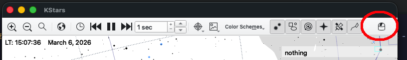
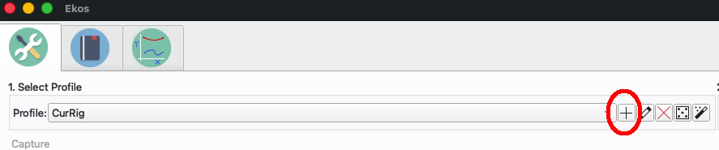

# Ekos/Indi Simulator setup

This will walk you through a mechanism to get you able to understand hoe to control your Astronomy equipment - so when it is dark (and clear???), things will be more familiar.

## Assumuptions

- indiserver is running with 3 devices
  - indi_simulator_telescope
  - indi_simulator_ccd
  - indi_simulator_guide

If this is not the case, then please go to [Getting started running Simulator](simulator.md), and see how to run the simulator.

## KStars

We need to have kstars running (either from command line, or from the menu) - the simulator also needs to be running.

In kstars we navigate to the EKOS module (shown in the Red circle)

### Create an Equipment Configuration

You may have more than 1 setup - wide field, solar, Deep Space - or you may just have 1.

We need to describe what the equipment we are trying to communicate with is.

Press the "+" and lets start describing our *simulator equipment*.

### Equipment Config

Fill out the equipment form  as shown below.

You can use the *Select Devices" to filter to **sim** to make your life easier.

Just remember than we only connected 3 things to the **indiserver** so we can only control 3 things - which have to be the same type.

The Name of this config I set as **Sim**, here you could have "Red Cat51" or "LX200" etc depending on your equipment.

### Start the connect

We just need to start the connection now

Note: I am starting the Equipment Config, called *Sim*.

You now will see 3 Tabs, one for each of the hardware we are trying to talk too.

As it is the 1st time - you probably will have to press **Connect** on **Each** piece of equipment.

If the connection works, the button will be green.

When you have checked all devices are connected ok, you can Close this using the Close button at the bottom.
